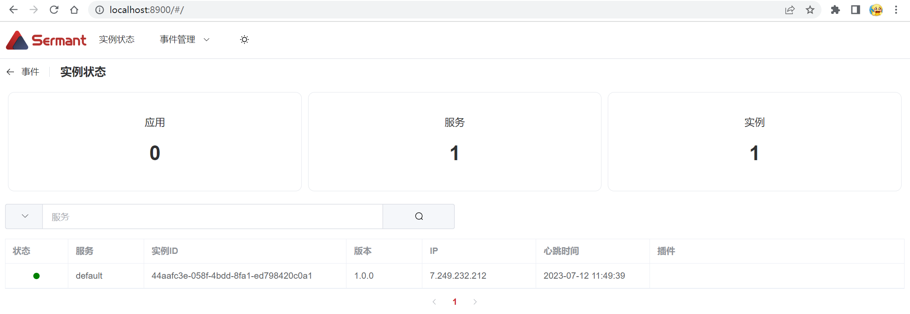

# Heartbeat Function

This article shows you how to use the heartbeat feature provided by Sermant in your development.

## Function Introduction

The heartbeat function plays a key role in the field of microservice governance. The heartbeat mechanism is used to monitor the status of each service instance, and the heartbeat is periodically reported to inform other services of its own survival status to avoid exceptions caused by instance downtime.

The **Sermant** reports the metadata of the service instance to **Backend** through the heartbeat. It also reports information about the loaded service governance plug-ins to inform **Backend** which service governance plug-ins are carried by the **Sermant Agent**. The **Backend** monitoring panel displays service instances that carry **Sermant Agents**.

> Attention: The heartbeat function must be used with the Backend monitoring panel. For details, see the [Backend User Manual](../user-guide/backend.md).

## Development Example

The development based on heartbeat capability is mainly used to allow plug-in developers to report a small amount of very important information of plug-ins through heartbeat, and can be observed in the monitoring panel. This development example is based on the project created in the documentation for [Create your first plugin](README.md).

In engineering `template\template-plugin` module under `com.huaweicloud.sermant.template.TemplateDeclarer` class add variable `heartbeatService` framework for the heart service, This parameter is used to set additional heartbeat information：

```java
HeartbeatService heartbeatService = ServiceManager.getService(HeartbeatService.class);
```

In the `before` method of [Interceptor](bytecode-enhancement.md#Interceptor) for the`main` method, set the heartbeat extra information via the `setExtInfo` interface:

```java
@Override
public ExecuteContext before(ExecuteContext context) throws Exception {
  heartbeatService.setExtInfo(() -> Collections.singletonMap("status", "started"));
  System.out.println("Good morning!");
  return context;
}
```

After the development is complete, you can follow the [Packaged build](README.md#Packaged-build) process when creating the first plug-in, execute the `mvn package` under the project root directory, refer to [Sermant Agent Parameter Configuration](../user-guide/sermant-agent.md#Parameter-Configuration) modification file `agent/config/config.properties`, and refer to [Backend User Manual](../user-guide/backend.md) Starts backend.

Finally, access `http://localhost:8900` to view Backend.



As you can see from the figure, there is currently one instance carrying **Sermant Agent**, and it is running properly, and it carries version `0.0.1` of the `template` plugin.

> **Sermant Agent** sends heartbeats to **Backend** on a regular basis. **Backend** will renew the heartbeats received from each **Sermant Agent**, and if they exceed the valid time (can be modified by [Backend Parameter Configuration](../user-guide/backend.md#Backend-Parameter-Configuration)). If a heartbeat has not been reported from a node, the node is set to be lost.

## API & Configuration

### API

**Get The Heartbeat Service**

Get the heartbeat service object, which is used to add additional information to the plug-in heartbeat data. This service is initialized by the framework and can be directly accessed by the plug-in.

```java
HeartbeatService heartbeatService = ServiceManager.getService(HeartbeatService.class);
```

**Add Additional Information About Heartbeat**

Developers can add additional information about the heartbeat to the plugin as follows:

```java
heartbeatService.setExtInfo(() -> Collections.singletonMap("key", "value"));
```

### Configuration

Based on the [Project structure](README.md#Project-structure) created in the first plugin, the heartbeat configuration is set by modifying the `config/config.properties` file.

|Configuration Items|Description|Example Configuration|
|---|---|---|
| heartbeat.interval | Heartbeat sending interval time in ms | heartbeat.interval=30000 |