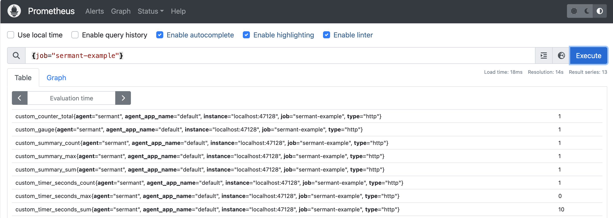

# 指标功能
本文档旨在指导用户如何使用Sermant的指标功能，以便通过Prometheus等监控工具实时监控Sermant的核心指标和插件的自定义指标。

## 功能介绍
为满足用户对Sermant运行状态和性能的实时监控需求，以及对插件行为的深入洞察，Sermant集成了Prometheus监控支持。用户可以通过Grafana等监控工具对Sermant的核心指标以及插件的自定义指标进行监控，并通过设置基于指标的告警来提前发现潜在问题，确保服务稳定性。

## 开发示例

以下是基于[创建首个插件](README.md)文档中的工程，演示插件如何创建自定义指标。

1. 在工程`template\template-plugin`模块下`io.sermant.template.TemplateInterceptor`类中，增加`metricService`变量以获取指标服务，用于自定义指标：

   ```java
   MetricService metricService = ServiceManager.getService(MetricService.class);
   ```

2. 调用MetricService提供的API执行相应的操作，如创建Counter、Gauge、Timer、Summary等类型的指标。
   ```java
    @Override
    public ExecuteContext doBefore(ExecuteContext context) {
        metricService.counter("custom.counter", Tags.of("type", "http")).increment();
        return context;
    }
   ```

3. 开启Metric服务，在`agent/config/config.properties`文件中设置以开启Metric服务，配置如下：
   
   > 注意：Metric服务依赖于 [HTTP Server服务](sermant-httpserver-service.md) 暴露的指标端点，因此需要先开启HTTP服务
   
   ```properties
   # HTTP server switch
   agent.service.httpserver.enable=true
   # Metric service switch
   agent.service.metric.enable=true
   ```

4. 配置Prometheus抓取Sermant暴露的指标端点：`http://localhost:47128/sermant/metrics` 。在Prometheus的`prometheus.yml`文件中，按以下格式进行配置：

   ```yaml
    scrape_configs:
    - job_name: 'sermant-example'
      metrics_path: '/sermant/metrics'
      static_configs:
        - targets: ['localhost:47128']
   ```
   
5. 启动Prometheus并验证指标数据的收集，如下图所示：
   


## API & 配置

### API

1. 获取Metric服务
   ```java
   MetricService metricService = ServiceManager.getService(MetricService.class);
   ```

2. 自定义指标

开发者可通过如下MetricService接口自定义各类指标（`Counter`、`Gauge`、`Timer`、`Summary`），以实现对程序运行状态的监控。

- 创建**Counter**类型的指标
   ```java
   MetricService metricService = ServiceManager.getService(MetricService.class);
   Counter counter = metricService.counter("custom.counter");
   counter.increment();
   ```
  
- 创建**Gauge**类型的指标
   ```java
   MetricService metricService = ServiceManager.getService(MetricService.class);
   Gauge gauge = metricService.gauge("custom.gauge");
   gauge.gaugeNumber(1);
   ```
  
- 创建**Timer**类型的指标
   ```java
   MetricService metricService = ServiceManager.getService(MetricService.class);
   Timer timer = metricService.timer("custom.timer");
   timer.record(10L, TimeUnit.SECONDS);
   ```
  
- 创建**Summary**类型的指标
   ```java
   MetricService metricService = ServiceManager.getService(MetricService.class);
   Summary summary = metricService.summary("custom.summary");
   summary.record(1.0);
   ```  

### 配置
在Sermant Agent的产品包 `agent/config/config.properties`，可通过`agent.service.httpserver.enable` 和 `agent.service.metric.enable` 配置项开启Metric服务，其他Metric服务的配置也在此文件中进行：

```properties
# The metric type, currently supports prometheus.
metric.type=prometheus
# The maximum number of metrics.
metric.maxTimeSeries=1000
```

## 注意事项
- Metric服务依赖于HTTP服务暴露的指标端点，因此在使用Metric服务前，请确保已开启[HTTP服务](sermant-httpserver-service.md)。
- 请在插件中正确使用MetricService API，以免造成指标数据不准确或丢失。
- 在配置Prometheus时，请确保正确设置了Sermant的HTTP Server地址和端口，以便Prometheus能够从Sermant获取指标数据。
